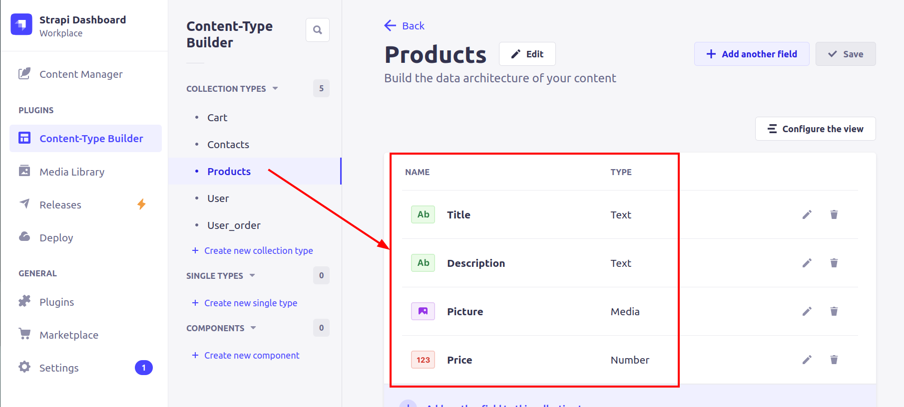

# Телеграм-Бот "Рыба Моя"

Продажа рыбной продукции через телеграм бот

* Удобный ввод позиций товара с картинками 
* Корзина пользователя 
* База контактов покупателей
* Проверка вводимых данных

## Как начать
### Начальные настройки
* Рекомендуется использовать [virtualenv/venv](https://www.docs.python.org/3/library/venv.html) для изоляции проекта
* Python3 должен быть уже установлен. [Python](https://www.python.org/downloads)
* Установите систему [CMS Strapi](https://docs.strapi.io/dev-docs/installation/cli)
## Предварительная подготовка
* Клонируем репозиторий
```commandline
git clone git@github.com:zatomis/Fish-MarketBot.git
```
* Установка зависимостей. Переходите в директорию с исполняемым файлом
```commandline
pip install -r requirements.txt
```
### Подготовка telegram
Создайте бота в [botfather](https://t.me/BotFather). Получите его токен.

### Подготовка Redis
[Установите](https://timeweb.cloud/tutorials/redis/ustanovka-i-nastrojka-redis-dlya-raznyh-os) Redis, 
либо воспользуйтесь [облачным сервисом](https://redis.com). Получите адрес, порт и пароль.

### Создание и настройка .env

Создайте в корне папки файл `.env`. Откройте его для редактирования любым текстовым редактором
и запишите данные в формате: `ПЕРЕМЕННАЯ=значение`.
Доступны следующие переменные:
- STRAPI_TOKEN - ваш Strapi ключ
- STRAPI_URL - адрес Strapi сервиса
- TELEGRAM_TOKEN - ваш телеграм токен
- REDIS_HOST - ваш Redis адрес
- REDIS_PORT - ваш Redis порт 

## Настройка сущностей strapi





## Пример работы телеграм бота:


## Цель проекта
Код написан в образовательных целях на онлайн-курсе для веб-разработчиков [Devman](https://dvmn.org)
